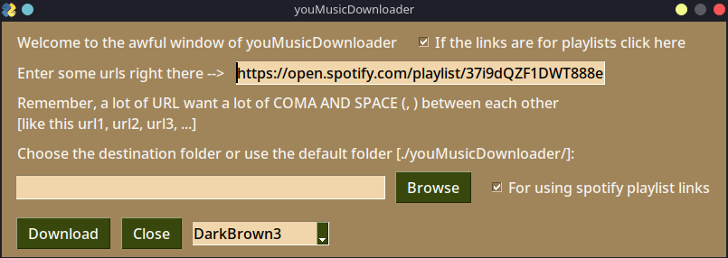

# youMusicDownloader
Python GUI for a youtube songs downloader. 

The code is partially mine, and partially not mine, do whatever u want with it, hope u upgrade it (it is not difficult).

## pip package that u need:
*PySimpleGUI*, *pytube*, *pillow*

`pip install pysimplegui`, `pip install pytube`, `pip install pillow` 

## GUI preview:

## Alert:
The code is now under construction, for **the right one look at the release and download it from there**

## Credit:
sti.ghi, DeusAres (for the rounded buttons)